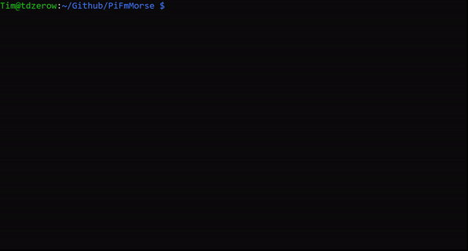

# PiFmMorse: A Morse Code FM Radio Transmitter for the Raspberry Pi
## Procedure

1. Run <code>sudo pfm.py</code> (If not it will ask for sudo password during program)
2. Type Input in Morse Code
3. After Audio Compilation, Select Frequency to Broadcast On.
4. You're done, tune an FM-Frequency on the Radio to listen to your input!
## Notes: 
1. This only works for Raspberry Pis with GPIO pins
2. You need <code>sudo</code> permissions to run this program, as the FM transmitter requires you to have them. Please run <code>sudo pfm.py</code> beforehand.
3. Without any antenna, the broadcast is limited to an area of aroudn 10 cm. To extend your coverage, please attach a wire (~10 cm) to extend your range to a few meters.
4. When doing FM Transmissions, always apply a Band-Pass Filter to prevent transmission leaks in the harmonics. 
5. Last but not least, make sure to follow FM transmissions guidelines for unlicensed transmission. If you are from the United States, consult the <a href="https://www.fcc.gov/media/radio/low-power-radio-general-information">FCC Guidlines Part 15</a> . In essence, don't interfere with occupied frequencies and make sure your transmissions doesn't extend over 200 ft (~60 meters).

## When trasmitting FM Signals, always use a Band Pass Filter!
Credits: Used the [FM Transmitter](https://github.com/markondej/fm_transmitter) Program created by [markendoej](https://github.com/markondej) to transmit the output wav file compiled in <code>pfm.py</code>.
## Disclaimer: Please follow the guidelines in your country when broadcasting FM Signals and Morse Code. Use your Raspberry Pi legally and responsibly. 

